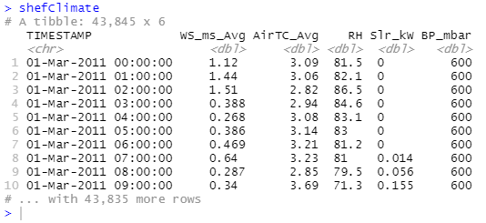
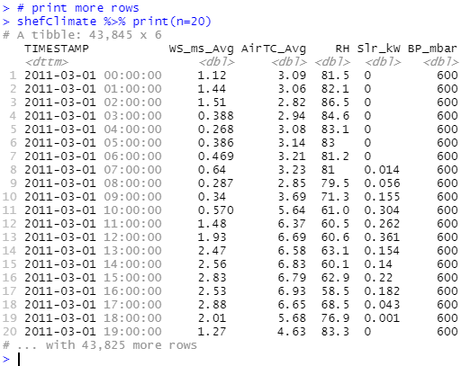
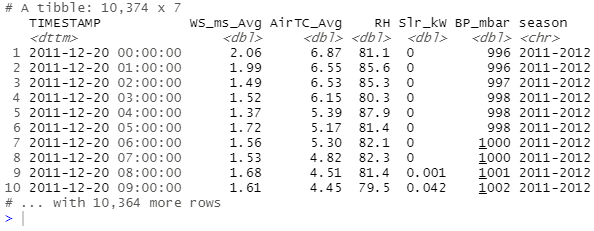
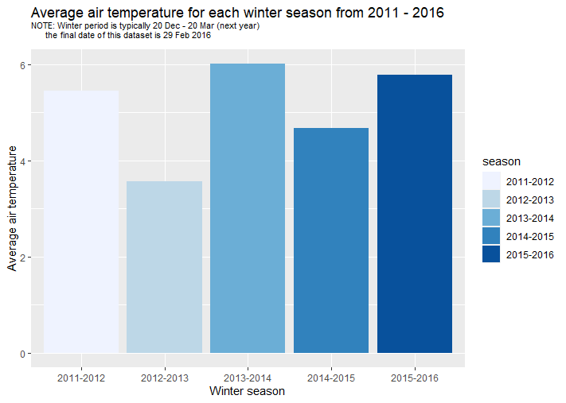
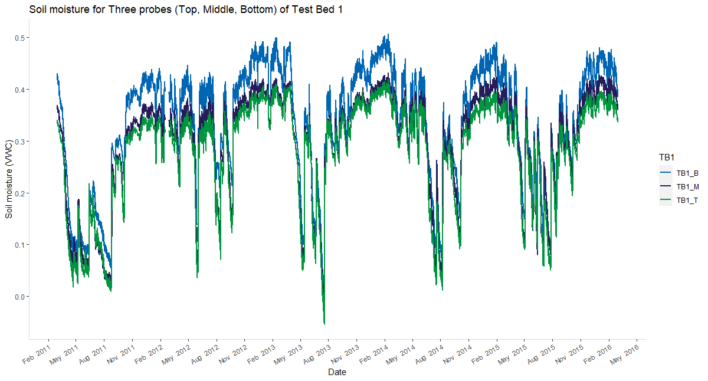

# Some Introduction
A great thing about R is that it is highly extensible with a wide variety of packages designed for 
specific purposes available on the internet. A R package is a collection that puts together 
reusable functions, some documentation describing these functions, and maybe some dataset you can 
utilise out of the box after you have installed the package. R itself includes a set of packages (we 
normally called them base packages) by default, but there are many more fantastic packages out there 
on the internet for you to explore.  
  
In this blog post we will explore some of the most popular packages in the process of visualising data. 
The dataset I am going to use is 
the [Hadfield Green Roof 5-year dataset](https://figshare.shef.ac.uk/articles/dataset/Hadfield_Green_Roof_5-year_Dataset/11876736) I 
have found on **Online Research Data** ([ORDA](https://orda.shef.ac.uk), The University of Sheffield's 
data repository). This dataset contains five CSV files which collected Sheffield climate data, 
soil moistures of testbeds, continuous cumulative rainfall runoff from the soil, continuous 
cumulative rainfall data, and whether the runoff measurements are valid, over the 5 years period from 2011 to 2016.  
  
Before you continue, you should already have some experience with R and be familiar with basic concepts 
such as data types, vector and list, dataframe, functions, and plot etc., and preferably have used 
[RStudio](https://rstudio.com/) before. You might find 
this <Link to="/blog/01/10/2020/moving-from-excel-to-r">blog post</Link> useful.  

You can find all the source code at [this Github repository](https://github.com/yld-weng/hadfield-green-roof). If you 
have any suggestions or want me to include any particular package feel 
free to [send me an email](mailto:yweng@sheffield.ac.uk)!

Let's get started and see what we can get from the dataset through these packages!  
  
  

# Tidyverse
I would refer to it as a library rather than a package because it contains a collection of highly usable 
packages and *"all packages share an underlying design philosophy, grammar, and data structure"*. A list 
of some packages from the library:  
 - [ggplot2](https://ggplot2.tidyverse.org/)  
 - [readr](https://readr.tidyverse.org/)  
 - [dplyr](https://dplyr.tidyverse.org/)  
 - [tidyr](https://tidyr.tidyverse.org/)  
 - [lubridate](https://lubridate.tidyverse.org/)

For each package there is an associate **cheat sheet** and you can find it in the link provided. I 
recommend you save a copy of each as it provides both text and graphical description for most of the 
functions, this is likely to help you to find the function you need more quickly and expose yourself 
to possibilities.  

## Load datasets
In the process of reading Sheffield 5-year climate data from University's data repository, I'm using 
the `read_csv` function from the *readr* package:  

```r
shefClimate <- read_csv("https://figshare.shef.ac.uk/ndownloader/files/25647497")
```

Notice that you can fetch data directly from Figshare using the download link. To get the link for your choosen 
data, hover your mouse on the dataset, then right click *download* and 
select *Copy Link Location* or *Copy link address* depending on your browser.  


*Read Sheffield Climate data*  

From the output we can see the `TIMESTAMP` column is of type character, what if we want it to be 
type `<datetime>`? To do this we can pass a list of types to the parameter `col_types` for the function to parse:  

```r
shefClimate <- read_csv(
  "https://figshare.shef.ac.uk/ndownloader/files/25647497",
  col_types = cols(
    col_datetime("%d-%b-%Y %H:%M:%S"),
    col_double(),
    col_double(),
    col_double(),
    col_double(),
    col_double()
  )
)
```  
  
  
You might have observed that outputs in the console are labelled as **tibble** - a 
package (also a part of the Tidyverse) for manipulating and displaying dataframe and it has 
become the default output for most of the Tidyverse functions that deals with dataframes. By 
default a large tibble will only show the first 10 rows, to print more results (say 20) 
use `datasetName %>% print(n=20)`. With `%>%` being called as pipe operator, if we have `x %>% f(y)` this 
is equivalent to `f(x, y)`, back to printing rows on above it would mean taking the 
dataset *x* then printing *y* rows and the function `f` will be `print()` in this case.  

  


## Missing values
Next thing will be to check existence of missing values or null values whether they are due to loss of 
information or on purpose. We can use the `summarise()` function to count how many null values 
in each column:  

```r
# apply function sum() to count number of NAs for all columns selected with everything()
shefClimate %>% summarise(across(everything(), ~sum(is.na(.x) | is.infinite(.x))))
```  


As you can see there are three functions in the code shown above. The `summarise()` function produces one 
or more rows of summary statistics specified by you for each combination of grouping 
variables (if no groups specified, it will apply to the whole dataframe); The `across()` function apply 
the same transformation to selected columns and the `everything()` function selects all variables in the 
dataframe. Putting it all together, we select all columns using `eveything()` and apply `sum()` function 
to all columns using `across()` and finally display the result with `summarise()`. For the same result using 
base packages you can also use:

```r
apply(shefClimate, 2, function(x) sum(is.na(x) | is.infinite(x)))
```

From the output above it appears that the column `TIMESTAMP` doesn't have any null values, let's take a look 
at the list of timestamp whilst other columns have been null:

```r
shefClimate %>% filter(across(!TIMESTAMP, ~is.na(.x)))
```


The `filter()` comes handy as it allows you to subset the dataframe and keep only rows that satisfy the condition 
you have passed within the function.

Check it is indeed the problem of timestamp by checking digits for minutes and seconds:

```r
# The minute() and the second() functions are included in the lubridate package
shefClimate %>% filter(minute(TIMESTAMP) != '0' | second(TIMESTAMP) != '0')
```

and we get the same output! Which means null values does not occurred at the beginning of the hour so we can 
go ahead to remove them.

Now, to remove these null values I can either use `drop_na()` from *tidyr* or use the `filter()` function:

```r
# Method 1
shefClimateNoNA <- shefClimate %>% drop_na()

# Method 2
shefClimateNoNA <- shefClimate %>% filter(across(everything(), ~ !(is.na(.x) | is.infinite(.x))))
```

Now we should check whether all hourly data exists in the dataset. My approach is to create a sequence of hours 
between the start date and the end date of the dataset, then check if all timestamps in the dataset exists in 
the sequence:

```r
allHours <- seq(
  from = as.POSIXct("2011-03-01", tz = "UTC"),
  to = as.POSIXct("2016-02-29 23:00:00", tz = "UTC"),
  by = "hour"
)

missingHours <- allHours[!(allHours %in% shefClimate$TIMESTAMP)]
missingHours
```
  

  
It turns out there are over **350** missing hours so let's try to fill the gaps!  
  
To make the dataset complete I took a very simple approach. For a missing hour if 
the previous hour exists (which means there is data available) then use the same 
data, otherwise use the computed average of the same hour from other years.

```r
imputeClimateData <- function(myDataset, missingHours) {
  newDataset = myDataset
  
  for (missingHour in missingHours) {
    lastHour = missingHour - 3600
    
    if (lastHour %in% myDataset$TIMESTAMP) {
      # add missing hour from last hour
      lastHourData <- myDataset %>% filter(TIMESTAMP == lastHour)
      lastHourData$TIMESTAMP = as.POSIXct(missingHour, origin="1970-01-01", tz = "UTC")
      
      # add a new row to the dataset
      newDataset <- newDataset %>% add_row(lastHourData)
      
    } else {
      # add missing hour using other year's average
      missingHourCT <- as.POSIXct(missingHour, origin="1970-01-01", tz = "UTC")
      
      month = month(missingHourCT) 
      day = day(missingHourCT)
      hour = hour(missingHourCT)
      
      allYearsAvg <- myDataset %>% 
        filter(
          hour(TIMESTAMP) == hour & 
          day(TIMESTAMP) == day & 
          month(TIMESTAMP) == month
        ) %>%
        summarise(across(everything(), ~ mean(.x)))
      
      allYearsAvg$TIMESTAMP = missingHourCT
      
      myDataset <- myDataset %>% add_row(allYearsAvg)
    }
  }
  # arrange/sort the dataset by date in ascending order
  return(newDataset %>% arrange(TIMESTAMP))
}

while (length(missingHours) != 0) {
  shefClimateNoNA <- imputeClimateData(shefClimateNoNA, missingHours)
  missingHours <- allHours[!(allHours %in% shefClimateNoNA$TIMESTAMP)]
}

# check if all hours exists
allHours[!(allHours %in% shefClimateNoNA$TIMESTAMP)]

# output: POSIXct of length 0
```  
  
  
## ggplot2
Now it is the time to draw some charts and graphs so we can get a better understanding of the dataset. It is not 
unusual that you already have some questions in hand before approaching the dataset and try to find the answers, 
and it is also common people will have more questions pop up when they examine charts for the dataset. I have 
prepared some questions for myself to get started:  
1. What is the difference between average temperature on Winter (usually 20 Dec to 20 March, but the dataset is 
   ended on 29 Feb 2016) for consecutive years  
2. Correlation between each pair of variables  
3. Density distribution of each variable  
4. Calculate FAO-56 Penman-Monteith  
5. Is there a difference in VWC (soil moisture) between top, middle, bottom probe for testbed 1  
   
There are many functions available within the *ggplot2* package and it is unlikely I will cover all of them. 
[Click here](https://ggplot2.tidyverse.org/) for cheat sheet and see what can you get from it. There will be 
some pictures in this section and I'll leave it to you to draw conclusions.  
  

### Bar chart
To get the date range out of the dataset I'm using the `between()` function from the *dplyr* package. I'm also using 
`|` (the OR operator) for filtering multiple date ranges:

```r
shefClimateNoNA %>%
  filter(
    between(TIMESTAMP, as.POSIXct("2011-12-20"), as.POSIXct("2012-03-20")) |
    between(TIMESTAMP, as.POSIXct("2012-12-20"), as.POSIXct("2013-03-20")) |
    between(TIMESTAMP, as.POSIXct("2013-12-20"), as.POSIXct("2014-03-20")) |
    between(TIMESTAMP, as.POSIXct("2014-12-20"), as.POSIXct("2015-03-20")) |
    between(TIMESTAMP, as.POSIXct("2015-12-20"), as.POSIXct("2016-02-29"))
  )
```  

But how do we group these dates into corresponding winter? Since there isn't any variables that allows us to group dates 
in a convenient way, I'm going to create a new column called `season` for indicating which winter season each timestamp 
belongs to:  
  
```r 
... %>% 
  mutate(
    season = if_else(
      month(TIMESTAMP) %in% c(11, 12),
      paste(year(TIMESTAMP), year(TIMESTAMP)+1, sep = "-"),
      paste(year(TIMESTAMP)-1, year(TIMESTAMP), sep = "-")
    )
  )  
```  
  
The `mutate()` function adds the new variable/column `season` specified within the bracket to the dataset and each row 
value is conditioned on which month that timestamp belongs to. The `paste()` function allows us to join multiple 
strings using the separator specified at the end of the function.



That's great! Now we can group dates by seasons and calculate average temperature for each season!

```r
... %>%
  group_by(season) %>%
  select(-TIMESTAMP) %>%
  summarise(across(everything(), ~mean(.x))) 
```

  

From the tibble shown above we can calculate the difference without effort so I won't do the calculations here, but do 
remember that we don't have data beyond 29th Feb 2016. Now I can use *ggplot2* to visualise the final outcome:  

```r
... %>%
  ggplot(data = ., aes(x = season, y = AirTC_Avg)) + 
  geom_col(aes(fill = season)) + 
  scale_fill_brewer(palette = "Blues") +
  labs(
    x = "Winter season", 
    y = "Average air temperature",
    title = 
      "Average air temperature for each winter season from 2011 - 2016",
    subtitle = 
      "NOTE: Winter period is typically 20 Dec - 20 Mar (next year)
      the final date of this dataset is 29 Feb 2016"
  ) +
  theme(
    plot.title = element_text(vjust = 1),
    plot.subtitle = element_text(size = 8, vjust = 4)
  )
```




### Tile plane  
The *stats* package has the `cor()` function for computing correlation:  

```r
corMatrix <- shefClimateNoNA %>% 
  select(-TIMESTAMP) %>% 
  cor() %>% 
  round(., 2)

corMatrix
```

  

However, as you can see we are getting a matrix with row indexes being variable values and that's not what we want 
for `ggplot()` plus `geom_tile()` which requires three columns - two for the combinations of variables and the 
third column being the correlation value. So here are some transformations:  
  
```r
corVars <- rownames(corMatrix)

corMatrix %>% 
  as_tibble() %>% 
  # decrease the number of columns
  # add more rows
  pivot_longer(       
    cols=1:5, 
    names_to = "var1", 
    values_to = "value"
  ) %>% 
  mutate(var2 = rep(corVars, each = 5)) %>%
  relocate(var2, .after = var1)
```  

  

You can also install the **reshape2** package which is commonly used to transform data into desire structures, but I 
will stick to functions within *Tidyverse* in this section to show you as many functions as possible.  

Now plot the graph: 

```r
... %>%
  ggplot(
    aes(x = var1, y = var2, fill = value)
  ) + 
  geom_tile(color="white", size=0.05) +
  scale_fill_gradient(low = "#fedf00", high = "#009640") + 
  geom_text(aes(label = round(value, 1)))
```

  

  

### Density plot
To produce a density plot for each variable I simply repeat the function for each variable:

```r
plot1 <- ggplot(data = shefClimateNoNA) + 
  geom_density(
    aes(x = WS_ms_Avg), fill = "#fedf00", color = "#fedf00", alpha = 0.8
  ) + 
  labs(
    x = "Average windspeed (m/s)", 
    title = "Density plot for Average windspeed (m/s)"
  )
  
plot2 <- ggplot(data = shefClimateNoNA) + 
  geom_density(
    aes(x = AirTC_Avg), fill = "#251d5a", color = "#251d5a", alpha = 0.8
  ) + 
  labs(
    x = "Average air temperature (C)", 
    title = "Density plot for Average air temperature (C)"
  )

plot3 <- ggplot(data = shefClimateNoNA) + 
  geom_density(
    aes(x = RH), fill = "#0066b3", color = "#0066b3", alpha = 0.8
  ) +
  labs(
    x = "Relative Humidity (%)", 
    title = "Density plot for Relative Humidity (%)"
  )

plot4 <- ggplot(data = shefClimateNoNA) + 
  geom_density(
    aes(x = Slr_kW), fill = "#009640", color = "#009640", alpha = 0.8
  ) +
  labs(
    x = "Solar Radiation (kW/m2)", 
    title = "Density plot for Solar Radiation (kW/m2)"
  )

plot5 <- ggplot(data = shefClimateNoNA) + 
  geom_density(
    aes(x = BP_mbar), fill = "#ade1f8", color = "#ade1f8", alpha = 0.8
  ) + 
  labs(
    x = "Barometric Pressure (mbar)",
    title = "Density plot for Barometric Pressure (mbar)"
  )
```

Then use the *gridExtra* package to arrange plots side by side:

```r
library(gridExtra)

grid.arrange(plot1, plot2, plot3, plot4, plot5, ncol=2)
```


 

### 2D-bin
Move on to the FAO-56 Penman-Monteith method which is used to approximate the sum of 
water evaporation and transpiration from a surface area. I'm not an expert in Hydrology but 
thanks to (Berretta, Poë and Stovin, 2014) and (Zotarelli, 2009) I was able to understand some 
details in the formula and come up with the following (correct me if you spot a mistake!):  

$$
\frac{0.408T(3.6Sr) + 0.066\frac{900}{24(T + 273)}(W(P - HP))}{T + 0.066(1 + 0.34W)}
$$

Where <br/>  
     
 * $W$ = Wind speed (m/s)  
 * $T$ = Average air temperature (C)  
 * $Sr$ = Solar Radiation (MJ/m2/h)  
 * $P$ = Pressure (kPa)  
 * and $H$ = Relative Humidity (expressed in fraction)

In the actual calculation I did some adjustment to match the unit:
 - Convert solar radiation from kilowatt to joules we need 1W = 1J/s => 1kw = 1000J/s = 60,000J/min 
  = 3,600,000J/hour = 3.6MJ/hour
 - Convert pressure to kPa by dividing it by 1000
 - Convert relative humidity to fraction

```r
shefClimateNoNA %>% 
  filter(
    between(
      TIMESTAMP, 
      as.POSIXct("2011-03-01"), 
      as.POSIXct("2012-03-01")
    )
  ) %>%
  mutate(
    FAO56 = (0.408 * AirTC_Avg * (Slr_kW * 3.6) + 
               0.066 * (900 / 24 / (AirTC_Avg + 273)) * 
               (WS_ms_Avg * (BP_mbar / 1000 - (RH / 100) * BP_mbar / 1000))
             ) / 
      (AirTC_Avg + 0.066 * (1 + 0.34 * WS_ms_Avg))
  ) 
```

Now I'm going to use 2D bin to visualise the density of FAO56 values:  

```r
... %>%
  ggplot(aes(x = TIMESTAMP, y = FAO56)) +
  geom_bin2d()
```

  


### Time series
For this section I'm going to compare VWC (soil moisture) between top, middle, bottom probe for testbed 1, so 
let's read another dataset from the repository:  

```r
shefVWC <- read_csv(
  "https://figshare.shef.ac.uk/ndownloader/files/25647500",
  col_types = cols(
    col_datetime("%d-%b-%Y %H:%M:%S"),
    col_double(),
    col_double(),
    col_double(),
    col_double(),
    col_double(),
    col_double(),
    col_double(),
    col_double(),
    col_double(),
    col_double(),
    col_double(),
    col_double()
  )
)
```

I would like a time series for each probe but also shown on a same graph and to achieve this I need to group values 
in a single column (as the `geom_line()` function only accepts two variables). To do this we can use the 
`pivot_longer()` function encountered before and create a new column which contains all values from columns *TB1_T*, 
*TB1_M*, and *TB1_B*. Then in the *ggplot()* function we specify the group parameter to be the new column and we're 
done! The last thing to do (as usual) will be styles, there are tones of customisation you can do to a chart and I 
encourage you to check out the ggplot2 cheat sheet.

```r
shefVWC %>% 
  pivot_longer(cols = TB1_T:TB1_B, names_to = "TB1", values_to = "TB1value") %>%
  ggplot(aes(x = TIMESTAMP, y = TB1value, group = TB1, color = TB1)) +
  geom_line(size = 0.9) +
  scale_color_manual(values = c("#0066b3", "#251d5a", "#009640")) +
  labs(
    x = "Date", 
    y = "Soil moisture (VWC)",
    title = "Soil moisture for Three probes (Top, Middle, Bottom) of Test Bed 1"
  ) + 
  scale_x_datetime(
    date_breaks = "3 month", 
    date_labels = "%b  %Y", 
    limits = c(as.POSIXct("2011-03-01", tz="UTC"), NA)
  ) +
  theme(
    axis.text.x = element_text(angle = 30, hjust = 1),
    panel.grid.major = element_blank(),
    panel.grid.minor = element_blank(),
    panel.background = element_blank(),
    axis.line = element_line(color = "#dbdbdb")
  )
```




# Plotly
Coming soon!


# ? ? ?


# References
Berretta, C., Poë, S. and Stovin, V. (2014). Moisture content behaviour in extensive green roofs 
during dry periods: The influence of vegetation and substrate characteristics. Journal of 
Hydrology, 511, pp.374–386.  
  
Zotarelli, L. (2009). AE459/AE459: Step by Step Calculation of the Penman-Monteith 
Evapotranspiration (FAO-56 Method). [online] Ufl.edu. Available at: https://edis.ifas.ufl.edu/ae459 [Accessed 14 Apr. 2019].

